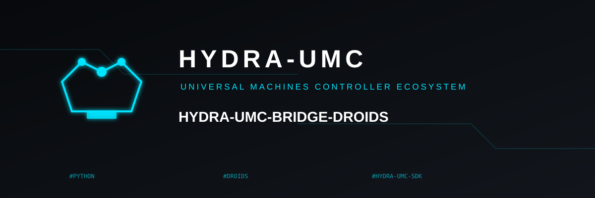

<!-- =============================================================================
HYDRA-UMC-BRIDGE-DROIDS - Legged/humanoid droid bidirectional coordination bridge
Copyright (C) 2026 JuanenRac (Electro Hobby 3D) <electrohobby3d@gmail.com>
GPL-3.0-or-later - see LICENSE
============================================================================= -->

<p align="center">
  
</p>

# 🤖 HYDRA-UMC-BRIDGE-DROIDS

<p align="center">🇺🇸 <b>English</b> | <a href="README_spa.md">🇪🇸 Español</a> | <a href="README_fra.md">🇫🇷 Français</a> | <a href="README_ita.md">🇮🇹 Italiano</a> | <a href="README_deu.md">🇩🇪 Deutsch</a> | <a href="README_zho.md">🇨🇳 简体中文</a> | <a href="README_jpn.md">🇯🇵 日本語</a></p>

### 🔗 Dependency-Free Coordination Boundary Between HYDRA-UMC and Legged/Humanoid Droids

<p align="left">
  
  
  
</p>

---

## 1. 🛠️ TECHNICAL OVERVIEW

**HYDRA-UMC-BRIDGE-DROIDS** is the bidirectional, high-level coordination boundary between HYDRA-UMC and a legged or humanoid droid platform, reachable over Wi-Fi, Bluetooth or a cellular (4G/5G) link. It never computes gait, balance or joint trajectories: it validates and forwards a small, named vocabulary of whole-body action triggers (`WALK_TO`, `PICK_OBJECT`, `PLACE_OBJECT`, `RETURN_HOME`, `HOLD_POSITION`, `STAND`, `SIT`), each with its own real required-parameter contract. It is not a motor-control node, and it cannot bypass HYDRA-UMC-SERVER, MCU limits, watchdogs or E-STOP.

It belongs to the **Mobile & Autonomous Bridges** family alongside `HYDRA-UMC-BRIDGE-AMR` and `HYDRA-UMC-BRIDGE-UAV`, and shares the same `HYDRA-UMC-SDK` job-and-safety contract as the stationary **External Automation Bridges** (CNC, LASER, OPENPNP, PRINTER3D, ROS2) - so no bridge, mobile or stationary, invents its own definition of "safe to work".

### Key Features:
* ✅ **Real, dependency-free coordination core:** `coordinator.py`'s `DroidCoordinator` has zero transport import (no socket, no vendor SDK) - it is deliberately plain Python, testable on any host without a real droid connected. *(implemented, tested in `tests/test_coordinator.py`)*
* ✅ **Real named action-trigger vocabulary:** `WALK_TO`, `PICK_OBJECT`, `PLACE_OBJECT`, `RETURN_HOME`, `HOLD_POSITION`, `STAND`, `SIT` - never a raw joint command. Whole-body gait, balance and joint-level control stay the droid's own onboard authority (Jetson-class or equivalent). `STAND`/`SIT` are real, near-universal legged-robot posture primitives - checked against Boston Dynamics' own public [Spot SDK `basic_command.proto`](https://github.com/boston-dynamics/spot-sdk/blob/master/protos/bosdyn/api/basic_command.proto), whose own foundational mobility commands are `stand`/`sit`/`selfright`/`safe_power_off`, not just walk/manipulate - exposed as standalone `sit_request()`/`stand_request()` calls, deliberately outside the `JobPhase`-driven `dispatch()` flow (no phase naturally means "stand up" or "sit down"). `sit_request()` is always accepted (a real de-escalation, same reasoning as `HOLD_POSITION`); `stand_request()` requires a `READY` cell and `IDLE` machine (a real productive-readiness transition). *(implemented)*
* ✅ **Real per-action parameter validation:** each action trigger has its own real, minimal required-parameter contract (e.g. `WALK_TO` needs `x`/`y`) checked before a job is ever forwarded - a request missing what its own action needs is rejected locally, not silently passed downstream. *(implemented, tested)*
* ✅ **Real shared safety gate:** every job dispatched through `DroidCoordinator.dispatch()` is evaluated by `evaluate_job()` from `HYDRA-UMC-SDK`'s `bridge_contract`, the same gate every sibling bridge and HYDRA-UMC-SERVER use; a productive phase requires an `IDLE` external machine and a `READY` HYDRA-UMC cell, while a `HOLD_POSITION` (mapped from `ABORT`) remains requestable during a fault. *(implemented)*
* ✅ **Fail-closed phase routing and static evidence:** an unknown future SDK phase is denied rather than guessed at. `inspect_action_plan.py` emits the static schema `1.1` action plan (now including `STAND`/`SIT`) without opening any transport. *(implemented, tested)*
* ✅ **Real Boston Dynamics Spot transport:** `spot_transport.py`'s `SpotDroidControl` sends an already-gated dispatch as a real bosdyn-client command (`synchro_stand_command`/`synchro_sit_command`/`synchro_trajectory_command_in_body_frame`, sent via `RobotCommandClient.robot_command()`) - a rejected dispatch never reaches the network. *(implemented, tested in `tests/test_spot_transport.py`)*
* ✅ **Non-mutating build/test:** `build-test.bat`/`.sh` compile the source and run deterministic unit tests without changing version or CHANGELOG. *(implemented, see BUILD & RUN below)*
* 🔜 **A generic Wi-Fi/BT/4G-5G transport adapter for a non-Spot droid platform** - introduced only after that platform is selected and tested. *(planned)*

---

## 2. 🔄 DROID COORDINATION FLOW


---

## 3. 🧱 ARCHITECTURE & DESIGN DECISIONS

* **Why the core never computes gait or balance.** A droid's own onboard compute (Jetson-class or equivalent) already runs a real, hardware-specific whole-body controller - re-deriving that here would either duplicate it badly or fight it. Sending only named destination/action triggers (`WALK_TO x y`, `PICK_OBJECT object_id`) keeps HYDRA-UMC's role to coordination, matching the pasted architecture note this project started from: "do not compute the droid's gait in the core."
* **Why each action trigger has its own explicit required-parameter list.** A `WALK_TO` with no `x`/`y`, or a `PICK_OBJECT` with no `object_id`, is a real, catchable request-shape error - rejecting it here, before any transport, is strictly better than forwarding an incomplete instruction and hoping the droid's own firmware rejects it safely too.
* **Why `DroidCoordinator.dispatch()` still funnels every job through the shared `evaluate_job()` gate.** A droid is just another client of the same `bridge_contract` that CNC, LASER, OPENPNP, PRINTER3D and ROS2 use - it gets no special bypass of the IDLE/READY logic every other bridge and HYDRA-UMC-SERVER enforce.
* **Why `HOLD_POSITION` (from `ABORT`) stays requestable during a fault.** The gate's productive-phase requirement (`IDLE` + `READY`) is intentionally not applied the same way to an abort request - an operator must always be able to ask a droid to freeze in place, even mid-fault, rather than continuing whatever it was doing.
* **Why the transport adapter and a concrete command interface are not in this repo yet.** Committing to one droid platform's real Wi-Fi/BT/4G-5G command protocol before it is selected and tested would risk baking in assumptions this local, dependency-free core cannot verify.
* **How this fits the rest of the ecosystem.** BRIDGE-DROIDS sits between a real droid and `HYDRA-UMC-SDK` → `HYDRA-UMC-SERVER` → MCU safety - it is a coordination boundary, never a motor-control node, and it cannot bypass HYDRA-UMC-SERVER, MCU limits, watchdogs or E-STOP.

---

## 📂 DIRECTORY STRUCTURE

```text
HYDRA-UMC-BRIDGE-DROIDS/
├── src/
│   └── hydra_umc_bridge_droids/
│       ├── __init__.py
│       ├── coordinator.py       # DroidCoordinator: dependency-free action-trigger gate
│       └── spot_transport.py    # Sends an already-gated DroidDispatch as a real bosdyn-client command
├── tests/
│   ├── test_coordinator.py      # Deterministic unit tests for the coordination core
│   └── test_spot_transport.py   # bosdyn-client command shape tests against a fake robot command client
├── tools/
│   ├── build_test.py            # Non-mutating compile + test runner (build-test.bat/.sh)
│   ├── bump_version.py          # Synchronizes pyproject.toml, manifest and CHANGELOG.md
│   └── inspect_action_plan.py   # Prints the static action plan (no transport opened)
├── docs/
│   └── BRIDGE_GUIDE.md          # Scope, compatible platforms, scripts, hardware acceptance gate
├── images/
│   └── HYDRA_UMC_BANNER.svg     # README banner
├── build-test.bat / build-test.sh  # Validate only, never modifies the repository
├── build.bat / build.sh            # Validate, then bump version + CHANGELOG on success
├── pyproject.toml               # Package metadata; depends on HYDRA-UMC-SDK (git)
├── hydra-umc.project.json       # Ecosystem manifest (version, maturity, family)
├── CHANGELOG.md
├── CODE_OF_CONDUCT.md / CONTRIBUTING.md / SECURITY.md / SUPPORT.md
├── LICENSE / LICENSE.md
└── README.md / README_*.md      # This file and its 6 translations
```

---

## 4. ⚙️ BUILD & RUN

Requires Python 3.11+. `tools/build_test.py` expects `HYDRA-UMC-SDK` checked out as a sibling directory (`../HYDRA-UMC-SDK`) or pointed at via the `HYDRA_UMC_SDK_ROOT` environment variable.

```bash
# Windows
build-test.bat      # validate only — no version/CHANGELOG change
build.bat            # validate, then bump version + CHANGELOG on success

# Linux/macOS
bash build-test.sh
bash build.sh
```

`build-test` compiles every module under `src/` with `py_compile` and runs the full `unittest` suite (`tests/test_coordinator.py`) - deterministically, with no real droid connection, no network and no version/CHANGELOG change. `build` runs that same validation first and, only on success, calls `tools/bump_version.py` to synchronize the version across `pyproject.toml`, `hydra-umc.project.json` and `CHANGELOG.md`. There is no live hardware `run` command yet - that requires a validated transport adapter and a real droid platform.

---

## ✅ Current Status & Next Steps

**Real today:** version `0.0.4`, functional as a dependency-free coordination core (`DroidCoordinator`) with real per-action parameter validation, fail-closed phase routing, a static `plan-only` action schema, a real bosdyn-client Spot command sender (`SpotDroidControl`), and non-mutating build-test scripts wired into CI with an SDK checkout.

**Integration boundary:** this bridge is a coordination boundary only - it is not a motor-control node, and it cannot bypass HYDRA-UMC-SERVER, MCU limits, watchdogs or E-STOP; every dispatched job still passes through the same shared gate every sibling bridge uses.

**Still ahead:** no real transport (Wi-Fi/BT/4G-5G) or physical droid has been validated yet - a real transport adapter and a documented droid command interface will be introduced only after a specific platform is selected and tested.

---

## 🔗 Related Projects

This project is part of a larger robotics ecosystem by the same author (JuanenRac / Electro Hobby 3D), spanning firmware, control software, AI nodes and fleet tooling. Worth knowing about, since a request might actually be about one of these rather than this repository.

### Directly Related

- **[HYDRA-UMC-SDK](https://github.com/JuanenRac/HYDRA-UMC-SDK)** — the shared job-and-safety contract every bridge (including this one) evaluates jobs through.
- **[HYDRA-UMC-SERVER](https://github.com/JuanenRac/HYDRA-UMC-SERVER)** — the authenticated ecosystem boundary this bridge reports to.
- **[HYDRA-UMC-BRIDGE-AMR](https://github.com/JuanenRac/HYDRA-UMC-BRIDGE-AMR)** — sibling mobile bridge for AGV/AMR fleets.
- **[HYDRA-UMC-BRIDGE-UAV](https://github.com/JuanenRac/HYDRA-UMC-BRIDGE-UAV)** — sibling mobile bridge for drones.

### Rest of the Ecosystem

**HYDRA-UMC platform** — the multi-robot micro-factory cell this bridge coordinates auxiliaries for
- **[HYDRA-UMC](https://github.com/JuanenRac/HYDRA-UMC)** — the CM5 + STM32H745 motherboard orchestrating up to 8 robot arms.
- **[HYDRA-UMC-SERVER](https://github.com/JuanenRac/HYDRA-UMC-SERVER)** — the Express/WebSocket backend every control client and bridge talks to.
- **[HYDRA-UMC-STUDIO](https://github.com/JuanenRac/HYDRA-UMC-STUDIO)** — web-based control dashboard, multi-robot 3D visualization.

**External Automation Bridges** — sibling repos sharing this same `HYDRA-UMC-SDK` job gate
- **[HYDRA-UMC-BRIDGE-CNC](https://github.com/JuanenRac/HYDRA-UMC-BRIDGE-CNC)** — CNC cell coordination bridge.
- **[HYDRA-UMC-BRIDGE-LASER](https://github.com/JuanenRac/HYDRA-UMC-BRIDGE-LASER)** — laser-cell coordination bridge.
- **[HYDRA-UMC-BRIDGE-OPENPNP](https://github.com/JuanenRac/HYDRA-UMC-BRIDGE-OPENPNP)** — board-flow bridge for OpenPnP.
- **[HYDRA-UMC-BRIDGE-PRINTER3D](https://github.com/JuanenRac/HYDRA-UMC-BRIDGE-PRINTER3D)** — coordination bridge for open 3D-printing software.
- **[HYDRA-UMC-BRIDGE-ROS2](https://github.com/JuanenRac/HYDRA-UMC-BRIDGE-ROS2)** — generic coordination bridge for any ROS 2 platform.

**Safety & Integration Evidence**
- **[HYDRA-UMC-SAFETY-ZONES](https://github.com/JuanenRac/HYDRA-UMC-SAFETY-ZONES)** — cell-zone safety evidence used across the bridge family.
- **[HYDRA-UMC-HIL-BRIDGE](https://github.com/JuanenRac/HYDRA-UMC-HIL-BRIDGE)** — hardware-in-the-loop test evidence.

## 👤 AUTHOR
**JuanenRac** (Electro Hobby 3D)
📧 electrohobby3d@gmail.com
📺 [youtube.com/@electrohobby3d](https://youtube.com/@electrohobby3d)

## 📜 LICENSE
GPL-3.0 - See LICENSE for details.
