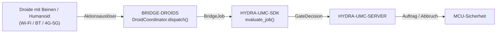

<!-- =============================================================================
HYDRA-UMC-BRIDGE-DROIDS - Bidirektionale Koordinationsbrücke für laufende/humanoide Droiden
Copyright (C) 2026 JuanenRac (Electro Hobby 3D) <electrohobby3d@gmail.com>
GPL-3.0-or-later - see LICENSE
============================================================================= -->

<p align="center">
  
</p>

# 🤖 HYDRA-UMC-BRIDGE-DROIDS

<p align="center"><a href="README.md">🇺🇸 English</a> | <a href="README_spa.md">🇪🇸 Español</a> | <a href="README_fra.md">🇫🇷 Français</a> | <a href="README_ita.md">🇮🇹 Italiano</a> | 🇩🇪 <b>Deutsch</b> | <a href="README_zho.md">🇨🇳 简体中文</a> | <a href="README_jpn.md">🇯🇵 日本語</a></p>

### 🔗 Abhängigkeitsfreie Koordinationsgrenze zwischen HYDRA-UMC und laufenden/humanoiden Droiden

<p align="left">
  
  
  
</p>

---

## 1. 🛠️ TECHNISCHER ÜBERBLICK

**HYDRA-UMC-BRIDGE-DROIDS** ist die bidirektionale, High-Level-Koordinationsgrenze zwischen HYDRA-UMC und einer Droiden-Plattform mit Beinen oder humanoider Bauart, erreichbar über Wi-Fi, Bluetooth oder eine Mobilfunkverbindung (4G/5G). Sie berechnet niemals Gangart, Gleichgewicht oder Gelenktrajektorien: Sie validiert und leitet ein kleines, benanntes Vokabular von Ganzkörper-Aktionsauslösern weiter (`WALK_TO`, `PICK_OBJECT`, `PLACE_OBJECT`, `RETURN_HOME`, `HOLD_POSITION`), jeder mit seinem eigenen realen Pflichtparameter-Vertrag. Sie ist kein Motorsteuerungsknoten und kann HYDRA-UMC-SERVER, MCU-Grenzen, Watchdogs oder den E-STOP nicht umgehen.

Sie gehört zur Familie **Mobile & Autonomous Bridges** neben `HYDRA-UMC-BRIDGE-AMR` und `HYDRA-UMC-BRIDGE-UAV` und teilt denselben `HYDRA-UMC-SDK`-Auftrags- und Sicherheitsvertrag wie die stationären **External Automation Bridges** (CNC, LASER, OPENPNP, PRINTER3D, ROS2) — sodass keine Brücke, ob mobil oder stationär, ihre eigene Definition von "sicher zum Arbeiten" erfindet.

### Kernfunktionen:
* ✅ **Echter, abhängigkeitsfreier Koordinationskern:** `coordinator.py`s `DroidCoordinator` hat keinerlei Transport-Import (kein Socket, kein Hersteller-SDK) — es ist bewusst reines Python, testbar auf jedem Host ohne angeschlossenen echten Droiden. *(implementiert, getestet in `tests/test_coordinator.py`)*
* ✅ **Echtes benanntes Aktionsauslöser-Vokabular:** `WALK_TO`, `PICK_OBJECT`, `PLACE_OBJECT`, `RETURN_HOME`, `HOLD_POSITION` — niemals ein roher Gelenkbefehl. Ganzkörper-Gangart, Gleichgewicht und gelenkbasierte Steuerung bleiben in der eigenen Onboard-Autorität des Droiden (Jetson-Klasse oder gleichwertig). *(implementiert)*
* ✅ **Echte Parametervalidierung pro Aktion:** jeder Aktionsauslöser hat seinen eigenen echten, minimalen Pflichtparameter-Vertrag (z. B. benötigt `WALK_TO` `x`/`y`), der geprüft wird, bevor ein Auftrag überhaupt weitergeleitet wird — eine Anfrage, der fehlt, was ihre eigene Aktion benötigt, wird lokal abgelehnt, nicht stillschweigend weitergereicht. *(implementiert, getestet)*
* ✅ **Echtes gemeinsames Sicherheitsgatter:** jeder über `DroidCoordinator.dispatch()` versendete Auftrag wird durch `evaluate_job()` aus dem `bridge_contract` von `HYDRA-UMC-SDK` bewertet, demselben Gatter, das jede Schwesterbrücke und HYDRA-UMC-SERVER verwenden; eine produktive Phase erfordert eine externe Maschine im Zustand `IDLE` und eine `READY`-HYDRA-UMC-Zelle, während `HOLD_POSITION` (abgebildet von `ABORT`) auch während eines Fehlers anforderbar bleibt. *(implementiert)*
* ✅ **Ausfallsicheres Phasenrouting und statische Evidenz:** eine unbekannte zukünftige SDK-Phase wird abgelehnt statt erraten. `inspect_action_plan.py` gibt den statischen Aktionsplan des Schemas `1.0` aus, ohne einen Transport zu öffnen. *(implementiert, getestet)*
* ✅ **Nicht-mutierender Build/Test:** `build-test.bat`/`.sh` kompilieren den Quellcode und führen deterministische Unit-Tests aus, ohne Version oder CHANGELOG zu ändern. *(implementiert, siehe BUILD & AUSFÜHRUNG unten)*
* 🔜 **Echter Wi-Fi/BT/4G-5G-Transportadapter und eine dokumentierte Droiden-Befehlsschnittstelle** — werden erst eingeführt, nachdem eine echte Plattform ausgewählt und getestet wurde. *(geplant)*

---

## 2. 🔄 DROID-KOORDINATIONSABLAUF



---

## 3. 🧱 ARCHITEKTUR UND DESIGN-ENTSCHEIDUNGEN

* **Warum der Kern niemals Gangart oder Gleichgewicht berechnet.** Das eigene Onboard-Compute des Droiden (Jetson-Klasse oder gleichwertig) führt bereits einen echten, hardwarespezifischen Ganzkörper-Controller aus — dies hier erneut herzuleiten würde ihn entweder schlecht duplizieren oder mit ihm in Konflikt geraten. Nur benannte Ziel-/Aktionsauslöser zu senden (`WALK_TO x y`, `PICK_OBJECT object_id`) hält die Rolle von HYDRA-UMC auf Koordination beschränkt, passend zu der eingefügten Architektur-Notiz, von der dieses Projekt ausging: "die Gangart des Droiden nicht im Kern berechnen."
* **Warum jeder Aktionsauslöser seine eigene explizite Liste von Pflichtparametern hat.** Ein `WALK_TO` ohne `x`/`y`, oder ein `PICK_OBJECT` ohne `object_id`, ist ein echter, erkennbarer Fehler in der Form der Anfrage — ihn hier abzulehnen, vor jedem Transport, ist strikt besser, als eine unvollständige Anweisung weiterzuleiten und zu hoffen, dass die eigene Firmware des Droiden sie ebenfalls sicher ablehnt.
* **Warum `DroidCoordinator.dispatch()` trotzdem jeden Auftrag durch das gemeinsame `evaluate_job()`-Gatter leitet.** Ein Droide ist nur ein weiterer Client desselben `bridge_contract`, den CNC, LASER, OPENPNP, PRINTER3D und ROS2 verwenden — er erhält keine besondere Umgehung der IDLE/READY-Logik, die jede andere Brücke und HYDRA-UMC-SERVER durchsetzen.
* **Warum `HOLD_POSITION` (von `ABORT`) während eines Fehlers anforderbar bleibt.** Die Anforderung der produktiven Phase des Gatters (`IDLE` + `READY`) wird bewusst nicht in derselben Weise auf eine Abbruchanfrage angewendet — ein Bediener muss einem Droiden immer befehlen können, an Ort und Stelle einzufrieren, selbst mitten in einem Fehler, statt fortzusetzen, was er gerade tat.
* **Warum der Transportadapter und eine konkrete Befehlsschnittstelle noch nicht in diesem Repository sind.** Sich vor der Auswahl und dem Test auf das echte Wi-Fi/BT/4G-5G-Befehlsprotokoll einer bestimmten Droiden-Plattform festzulegen, würde riskieren, Annahmen einzubauen, die dieser lokale, abhängigkeitsfreie Kern nicht verifizieren kann.
* **Wie das in den Rest des Ökosystems passt.** BRIDGE-DROIDS sitzt zwischen einem echten Droiden und `HYDRA-UMC-SDK` → `HYDRA-UMC-SERVER` → MCU-Sicherheit — es ist eine Koordinationsgrenze, niemals ein Motorsteuerungsknoten, und es kann HYDRA-UMC-SERVER, MCU-Grenzen, Watchdogs oder den E-STOP nicht umgehen.

---

## 📂 VERZEICHNISSTRUKTUR

```text
HYDRA-UMC-BRIDGE-DROIDS/
├── src/
│   └── hydra_umc_bridge_droids/
│       ├── __init__.py
│       └── coordinator.py       # DroidCoordinator: abhängigkeitsfreies Aktionsauslöser-Gatter
├── tests/
│   └── test_coordinator.py      # Deterministische Unit-Tests für den Koordinationskern
├── tools/
│   ├── build_test.py            # Nicht-mutierender Compiler + Testläufer (build-test.bat/.sh)
│   ├── bump_version.py          # Synchronisiert pyproject.toml, Manifest und CHANGELOG.md
│   └── inspect_action_plan.py   # Gibt den statischen Aktionsplan aus (kein Transport geöffnet)
├── docs/
│   └── BRIDGE_GUIDE.md          # Umfang, kompatible Plattformen, Skripte, Hardware-Abnahmegatter
├── build-test.bat / build-test.sh  # Validiert nur, ändert das Repository nie
├── build.bat / build.sh            # Validiert und erhöht bei Erfolg Version + CHANGELOG
├── pyproject.toml               # Paket-Metadaten; hängt von HYDRA-UMC-SDK ab (git)
├── hydra-umc.project.json       # Ökosystem-Manifest (Version, Reifegrad, Familie)
├── CHANGELOG.md
├── CODE_OF_CONDUCT.md / CONTRIBUTING.md / SECURITY.md / SUPPORT.md
├── LICENSE / LICENSE.md
└── README.md / README_*.md      # Diese Datei und ihre 6 Übersetzungen
```

---

## 4. ⚙️ BUILD & AUSFÜHRUNG

Erfordert Python 3.11+. `tools/build_test.py` erwartet, dass `HYDRA-UMC-SDK` als Schwesterverzeichnis (`../HYDRA-UMC-SDK`) ausgecheckt oder über die Umgebungsvariable `HYDRA_UMC_SDK_ROOT` angegeben ist.

```bash
# Windows
build-test.bat      # nur Validierung — keine Versions-/CHANGELOG-Änderung
build.bat            # validiert und erhöht bei Erfolg Version + CHANGELOG

# Linux/macOS
bash build-test.sh
bash build.sh
```

`build-test` kompiliert jedes Modul unter `src/` mit `py_compile` und führt die vollständige `unittest`-Suite aus (`tests/test_coordinator.py`) — deterministisch, ohne echte Droiden-Verbindung, ohne Netzwerk und ohne Versions-/CHANGELOG-Änderung. `build` führt zuerst dieselbe Validierung aus und ruft nur bei Erfolg `tools/bump_version.py` auf, um die Version in `pyproject.toml`, `hydra-umc.project.json` und `CHANGELOG.md` zu synchronisieren. Es gibt noch keinen echten Hardware-`run`-Befehl — dafür sind ein validierter Transportadapter und eine echte Droiden-Plattform erforderlich.

---

## ✅ Aktueller Status & Nächste Schritte

**Heute real:** Version `0.0.1`, funktionsfähig als abhängigkeitsfreier Koordinationskern (`DroidCoordinator`) mit echter Parametervalidierung pro Aktion, ausfallsicherem Phasenrouting, einem statischen `plan-only`-Aktionsschema sowie nicht-mutierenden Build-Test-Skripten, die in CI mit SDK-Checkout eingebunden sind.

**Integrationsgrenze:** diese Brücke ist ausschließlich eine Koordinationsgrenze — sie ist kein Motorsteuerungsknoten und kann HYDRA-UMC-SERVER, MCU-Grenzen, Watchdogs oder den E-STOP nicht umgehen; jeder versendete Auftrag durchläuft weiterhin dasselbe gemeinsame Gatter, das jede Schwesterbrücke verwendet.

**Noch offen:** es wurde noch kein echter Transport (Wi-Fi/BT/4G-5G) und kein physischer Droide validiert — ein echter Transportadapter und eine dokumentierte Droiden-Befehlsschnittstelle werden erst eingeführt, nachdem eine bestimmte Plattform ausgewählt und getestet wurde.

---

## 🔗 Verwandte Projekte

Dieses Projekt ist Teil eines größeren Robotik-Ökosystems desselben Autors (JuanenRac / Electro Hobby 3D), das Firmware, Steuerungssoftware, KI-Knoten und Flotten-Tooling umfasst. Es lohnt sich, das zu wissen, da eine Anfrage tatsächlich eines dieser Projekte betreffen könnte statt dieses Repositorys.

### Direkt verwandt

- **[HYDRA-UMC-SDK](https://github.com/JuanenRac/HYDRA-UMC-SDK)** — der gemeinsame Auftrags- und Sicherheitsvertrag, durch den jede Brücke (einschließlich dieser) ihre Aufträge bewertet.
- **[HYDRA-UMC-SERVER](https://github.com/JuanenRac/HYDRA-UMC-SERVER)** — die authentifizierte Ökosystemgrenze, an die diese Brücke berichtet.
- **[HYDRA-UMC-BRIDGE-AMR](https://github.com/JuanenRac/HYDRA-UMC-BRIDGE-AMR)** — Schwester-Mobilbrücke für AGV-/AMR-Flotten.
- **[HYDRA-UMC-BRIDGE-UAV](https://github.com/JuanenRac/HYDRA-UMC-BRIDGE-UAV)** — Schwester-Mobilbrücke für Drohnen.

### Rest des Ökosystems

**HYDRA-UMC-Plattform** — die Multi-Roboter-Mikrofabrikzelle, für die diese Brücke Hilfsfunktionen koordiniert
- **[HYDRA-UMC](https://github.com/JuanenRac/HYDRA-UMC)** — die CM5- + STM32H745-Hauptplatine, die bis zu 8 Roboterarme orchestriert.
- **[HYDRA-UMC-SERVER](https://github.com/JuanenRac/HYDRA-UMC-SERVER)** — das Express/WebSocket-Backend, mit dem jeder Steuerungsclient und jede Brücke spricht.
- **[HYDRA-UMC-STUDIO](https://github.com/JuanenRac/HYDRA-UMC-STUDIO)** — webbasiertes Steuerungs-Dashboard, Multi-Roboter-3D-Visualisierung.

**External Automation Bridges** — Schwester-Repositories, die dasselbe `HYDRA-UMC-SDK`-Auftragsgatter teilen
- **[HYDRA-UMC-BRIDGE-CNC](https://github.com/JuanenRac/HYDRA-UMC-BRIDGE-CNC)** — CNC-Zellkoordinationsbrücke.
- **[HYDRA-UMC-BRIDGE-LASER](https://github.com/JuanenRac/HYDRA-UMC-BRIDGE-LASER)** — Koordinationsbrücke für Laserzellen.
- **[HYDRA-UMC-BRIDGE-OPENPNP](https://github.com/JuanenRac/HYDRA-UMC-BRIDGE-OPENPNP)** — Board-Flow-Brücke für OpenPnP.
- **[HYDRA-UMC-BRIDGE-PRINTER3D](https://github.com/JuanenRac/HYDRA-UMC-BRIDGE-PRINTER3D)** — Koordinationsbrücke für offene 3D-Drucksoftware.
- **[HYDRA-UMC-BRIDGE-ROS2](https://github.com/JuanenRac/HYDRA-UMC-BRIDGE-ROS2)** — generische Koordinationsbrücke für jede ROS-2-Plattform.

**Sicherheits- und Integrationsnachweise**
- **[HYDRA-UMC-SAFETY-ZONES](https://github.com/JuanenRac/HYDRA-UMC-SAFETY-ZONES)** — Sicherheitsnachweise für Zellzonen, die in der gesamten Brückenfamilie verwendet werden.
- **[HYDRA-UMC-HIL-BRIDGE](https://github.com/JuanenRac/HYDRA-UMC-HIL-BRIDGE)** — Hardware-in-the-Loop-Testnachweise.

## 👤 AUTOR
**JuanenRac** (Electro Hobby 3D)
📧 electrohobby3d@gmail.com

## 📜 LIZENZ
GPL-3.0 - Siehe LICENSE für Details.
