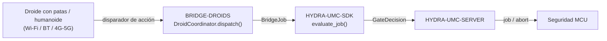

<!-- =============================================================================
HYDRA-UMC-BRIDGE-DROIDS - Puente de coordinación bidireccional para droides con patas/humanoides
Copyright (C) 2026 JuanenRac (Electro Hobby 3D) <electrohobby3d@gmail.com>
GPL-3.0-or-later - see LICENSE
============================================================================= -->

<p align="center">
  
</p>

# 🤖 HYDRA-UMC-BRIDGE-DROIDS

<p align="center"><a href="README.md">🇺🇸 English</a> | 🇪🇸 <b>Español</b> | <a href="README_fra.md">🇫🇷 Français</a> | <a href="README_ita.md">🇮🇹 Italiano</a> | <a href="README_deu.md">🇩🇪 Deutsch</a> | <a href="README_zho.md">🇨🇳 简体中文</a> | <a href="README_jpn.md">🇯🇵 日本語</a></p>

### 🔗 Frontera de coordinación sin dependencias entre HYDRA-UMC y droides con patas/humanoides

<p align="left">
  
  
  
</p>

---

## 1. 🛠️ VISIÓN TÉCNICA GENERAL

**HYDRA-UMC-BRIDGE-DROIDS** es la frontera de coordinación bidireccional de alto nivel entre HYDRA-UMC y un droide con patas o humanoide, accesible por Wi-Fi, Bluetooth o un enlace celular (4G/5G). Nunca calcula la marcha, el equilibrio ni las trayectorias articulares: valida y reenvía un vocabulario reducido y con nombre de disparadores de acción de cuerpo completo (`WALK_TO`, `PICK_OBJECT`, `PLACE_OBJECT`, `RETURN_HOME`, `HOLD_POSITION`), cada uno con su propio contrato real de parámetros obligatorios. No es un nodo de control de motores, y no puede saltarse a HYDRA-UMC-SERVER, los límites del MCU, los watchdogs ni el E-STOP.

Pertenece a la familia **Mobile & Autonomous Bridges** junto a `HYDRA-UMC-BRIDGE-AMR` y `HYDRA-UMC-BRIDGE-UAV`, y comparte el mismo contrato de trabajo y seguridad de `HYDRA-UMC-SDK` que los **External Automation Bridges** estacionarios (CNC, LASER, OPENPNP, PRINTER3D, ROS2) - así que ningún bridge, móvil o estacionario, inventa su propia definición de "seguro para trabajar".

### Características clave:
* ✅ **Núcleo de coordinación real, sin dependencias:** `coordinator.py`'s `DroidCoordinator` no importa ningún transporte (ni socket, ni SDK de fabricante) - es deliberadamente Python puro, comprobable en cualquier máquina sin un droide real conectado. *(implementado, probado en `tests/test_coordinator.py`)*
* ✅ **Vocabulario real de disparadores de acción con nombre:** `WALK_TO`, `PICK_OBJECT`, `PLACE_OBJECT`, `RETURN_HOME`, `HOLD_POSITION` - nunca un comando articular en bruto. La marcha, el equilibrio y el control articular siguen siendo autoridad propia del controlador embarcado del droide (tipo Jetson o equivalente). *(implementado)*
* ✅ **Validación real de parámetros por acción:** cada disparador de acción tiene su propio contrato real y mínimo de parámetros obligatorios (p. ej. `WALK_TO` necesita `x`/`y`) comprobado antes de reenviar el trabajo - una petición a la que le falta lo que su propia acción necesita se rechaza localmente, no se pasa en silencio aguas abajo. *(implementado, probado)*
* ✅ **Puerta de seguridad compartida real:** cada trabajo despachado mediante `DroidCoordinator.dispatch()` se evalúa con `evaluate_job()` de `bridge_contract` de `HYDRA-UMC-SDK`, la misma puerta que usan todos los bridges hermanos y HYDRA-UMC-SERVER; una fase productiva exige una máquina externa `IDLE` y una celda HYDRA-UMC `READY`, mientras que `HOLD_POSITION` (mapeado desde `ABORT`) sigue siendo solicitable durante un fallo. *(implementado)*
* ✅ **Enrutado de fase con fallo cerrado y evidencia estática:** una fase futura del SDK desconocida se rechaza en vez de adivinarse. `inspect_action_plan.py` emite el plan de acción estático del esquema `1.0` sin abrir ningún transporte. *(implementado, probado)*
* ✅ **Build/test sin mutación:** `build-test.bat`/`.sh` compilan el código fuente y ejecutan tests unitarios deterministas sin cambiar la versión ni el CHANGELOG. *(implementado, ver BUILD Y EJECUCIÓN más abajo)*
* 🔜 **Adaptador de transporte real Wi-Fi/BT/4G-5G y una interfaz de comandos de droide documentada** - se introducirán solo después de seleccionar y probar una plataforma real. *(planeado)*

---

## 2. 🔄 FLUJO DE COORDINACIÓN DEL DROIDE



---

## 3. 🧱 ARQUITECTURA Y DECISIONES DE DISEÑO

* **Por qué el núcleo nunca calcula marcha ni equilibrio.** El propio cómputo embarcado del droide (tipo Jetson o equivalente) ya ejecuta un controlador de cuerpo completo real y específico del hardware - volver a calcularlo aquí lo duplicaría mal o entraría en conflicto con él. Enviar solo disparadores de destino/acción con nombre (`WALK_TO x y`, `PICK_OBJECT object_id`) mantiene el papel de HYDRA-UMC en la coordinación, siguiendo la nota de arquitectura pegada de la que partió este proyecto: "no calcular la marcha del droide en el núcleo".
* **Por qué cada disparador de acción tiene su propia lista explícita de parámetros obligatorios.** Un `WALK_TO` sin `x`/`y`, o un `PICK_OBJECT` sin `object_id`, es un error real y detectable en la forma de la petición - rechazarlo aquí, antes de cualquier transporte, es estrictamente mejor que reenviar una instrucción incompleta y confiar en que el propio firmware del droide también la rechace de forma segura.
* **Por qué `DroidCoordinator.dispatch()` sigue canalizando cada trabajo por la puerta compartida `evaluate_job()`.** Un droide es solo otro cliente del mismo `bridge_contract` que usan CNC, LASER, OPENPNP, PRINTER3D y ROS2 - no tiene ningún salto especial de la lógica IDLE/READY que hacen cumplir todos los demás bridges y HYDRA-UMC-SERVER.
* **Por qué `HOLD_POSITION` (desde `ABORT`) sigue siendo solicitable durante un fallo.** El requisito de fase productiva de la puerta (`IDLE` + `READY`) deliberadamente no se aplica igual a una petición de aborto - un operador siempre debe poder pedirle a un droide que se quede quieto donde está, incluso en mitad de un fallo, en vez de seguir con lo que estuviera haciendo.
* **Por qué el adaptador de transporte y una interfaz de comandos concreta aún no están en este repositorio.** Comprometerse con el protocolo de comandos real Wi-Fi/BT/4G-5G de una plataforma concreta antes de seleccionarla y probarla arriesgaría a dar por sentadas suposiciones que este núcleo local y sin dependencias no puede verificar.
* **Cómo encaja esto en el resto del ecosistema.** BRIDGE-DROIDS se sitúa entre un droide real y `HYDRA-UMC-SDK` → `HYDRA-UMC-SERVER` → seguridad MCU - es una frontera de coordinación, nunca un nodo de control de motores, y no puede saltarse HYDRA-UMC-SERVER, los límites del MCU, los watchdogs ni el E-STOP.

---

## 📂 ESTRUCTURA DE DIRECTORIOS

```text
HYDRA-UMC-BRIDGE-DROIDS/
├── src/
│   └── hydra_umc_bridge_droids/
│       ├── __init__.py
│       └── coordinator.py       # DroidCoordinator: puerta de disparadores de acción sin dependencias
├── tests/
│   └── test_coordinator.py      # Tests unitarios deterministas del núcleo de coordinación
├── tools/
│   ├── build_test.py            # Compilación + tests sin mutación (build-test.bat/.sh)
│   ├── bump_version.py          # Sincroniza pyproject.toml, manifiesto y CHANGELOG.md
│   └── inspect_action_plan.py   # Imprime el plan de acción estático (sin abrir transporte)
├── docs/
│   └── BRIDGE_GUIDE.md          # Alcance, plataformas compatibles, scripts, puerta de aceptación de hardware
├── build-test.bat / build-test.sh  # Solo valida, nunca modifica el repositorio
├── build.bat / build.sh            # Valida y luego sube versión + CHANGELOG si tiene éxito
├── pyproject.toml               # Metadatos del paquete; depende de HYDRA-UMC-SDK (git)
├── hydra-umc.project.json       # Manifiesto del ecosistema (versión, madurez, familia)
├── CHANGELOG.md
├── CODE_OF_CONDUCT.md / CONTRIBUTING.md / SECURITY.md / SUPPORT.md
├── LICENSE / LICENSE.md
└── README.md / README_*.md      # Este archivo y sus 6 traducciones
```

---

## 4. ⚙️ BUILD Y EJECUCIÓN

Requiere Python 3.11+. `tools/build_test.py` espera `HYDRA-UMC-SDK` clonado como directorio hermano (`../HYDRA-UMC-SDK`) o indicado mediante la variable de entorno `HYDRA_UMC_SDK_ROOT`.

```bash
# Windows
build-test.bat      # solo valida — sin cambio de versión/CHANGELOG
build.bat            # valida y luego sube versión + CHANGELOG si tiene éxito

# Linux/macOS
bash build-test.sh
bash build.sh
```

`build-test` compila cada módulo bajo `src/` con `py_compile` y ejecuta la suite completa de `unittest` (`tests/test_coordinator.py`) - de forma determinista, sin conexión real a ningún droide, sin red y sin cambio de versión/CHANGELOG. `build` ejecuta esa misma validación primero y, solo si tiene éxito, llama a `tools/bump_version.py` para sincronizar la versión entre `pyproject.toml`, `hydra-umc.project.json` y `CHANGELOG.md`. Todavía no existe un comando `run` con hardware real - eso requiere un adaptador de transporte validado y una plataforma de droide real.

---

## ✅ Estado actual y próximos pasos

**Real hoy:** versión `0.0.1`, funcional como núcleo de coordinación sin dependencias (`DroidCoordinator`) con validación real de parámetros por acción, enrutado de fase con fallo cerrado, un esquema de acción estático `plan-only`, y scripts de build-test sin mutación integrados en CI con un checkout del SDK.

**Frontera de integración:** este bridge es solo una frontera de coordinación - no es un nodo de control de motores, y no puede saltarse HYDRA-UMC-SERVER, los límites del MCU, los watchdogs ni el E-STOP; cada trabajo despachado sigue pasando por la misma puerta compartida que usan todos los bridges hermanos.

**Todavía pendiente:** aún no se ha validado ningún transporte real (Wi-Fi/BT/4G-5G) ni un droide físico - un adaptador de transporte real y una interfaz de comandos de droide documentada se introducirán solo después de seleccionar y probar una plataforma concreta.

---

## 🔗 Proyectos relacionados

Este proyecto forma parte de un ecosistema de robótica más amplio del mismo autor (JuanenRac / Electro Hobby 3D), que abarca firmware, software de control, nodos de IA y herramientas de flota. Vale la pena conocerlo, ya que una petición podría en realidad ser sobre uno de estos en vez de sobre este repositorio.

### Directamente relacionados

- **[HYDRA-UMC-SDK](https://github.com/JuanenRac/HYDRA-UMC-SDK)** — el contrato compartido de trabajo y seguridad por el que pasa cada bridge (incluido este).
- **[HYDRA-UMC-SERVER](https://github.com/JuanenRac/HYDRA-UMC-SERVER)** — la frontera autenticada del ecosistema a la que reporta este bridge.
- **[HYDRA-UMC-BRIDGE-AMR](https://github.com/JuanenRac/HYDRA-UMC-BRIDGE-AMR)** — bridge móvil hermano para flotas AGV/AMR.
- **[HYDRA-UMC-BRIDGE-UAV](https://github.com/JuanenRac/HYDRA-UMC-BRIDGE-UAV)** — bridge móvil hermano para drones.

### Resto del ecosistema

**Plataforma HYDRA-UMC** — la microfábrica multi-robot para la que este bridge coordina auxiliares
- **[HYDRA-UMC](https://github.com/JuanenRac/HYDRA-UMC)** — la placa base CM5 + STM32H745 que orquesta hasta 8 brazos robóticos.
- **[HYDRA-UMC-SERVER](https://github.com/JuanenRac/HYDRA-UMC-SERVER)** — el backend Express/WebSocket con el que habla cada cliente de control y cada bridge.
- **[HYDRA-UMC-STUDIO](https://github.com/JuanenRac/HYDRA-UMC-STUDIO)** — panel de control web, visualización 3D multi-robot.

**External Automation Bridges** — repos hermanos que comparten la misma puerta `HYDRA-UMC-SDK`
- **[HYDRA-UMC-BRIDGE-CNC](https://github.com/JuanenRac/HYDRA-UMC-BRIDGE-CNC)** — bridge de coordinación de celda CNC.
- **[HYDRA-UMC-BRIDGE-LASER](https://github.com/JuanenRac/HYDRA-UMC-BRIDGE-LASER)** — bridge de coordinación de celda láser.
- **[HYDRA-UMC-BRIDGE-OPENPNP](https://github.com/JuanenRac/HYDRA-UMC-BRIDGE-OPENPNP)** — bridge de flujo de placas para OpenPnP.
- **[HYDRA-UMC-BRIDGE-PRINTER3D](https://github.com/JuanenRac/HYDRA-UMC-BRIDGE-PRINTER3D)** — bridge de coordinación para software de impresión 3D abierto.
- **[HYDRA-UMC-BRIDGE-ROS2](https://github.com/JuanenRac/HYDRA-UMC-BRIDGE-ROS2)** — bridge de coordinación genérico para cualquier plataforma ROS 2.

**Evidencia de seguridad e integración**
- **[HYDRA-UMC-SAFETY-ZONES](https://github.com/JuanenRac/HYDRA-UMC-SAFETY-ZONES)** — evidencia de seguridad por zonas de celda usada en toda la familia de bridges.
- **[HYDRA-UMC-HIL-BRIDGE](https://github.com/JuanenRac/HYDRA-UMC-HIL-BRIDGE)** — evidencia de pruebas hardware-in-the-loop.

## 👤 AUTOR
**JuanenRac** (Electro Hobby 3D)
📧 electrohobby3d@gmail.com

## 📜 LICENCIA
GPL-3.0 - Ver LICENSE para más detalles.
