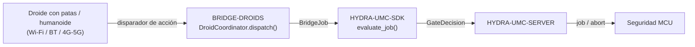

<!-- =============================================================================
HYDRA-UMC-BRIDGE-DROIDS - Puente de coordinación bidireccional para droides con patas/humanoides
Copyright (C) 2026 JuanenRac (Electro Hobby 3D) <electrohobby3d@gmail.com>
GPL-3.0-or-later - see LICENSE
============================================================================= -->

<p align="center">
  
</p>

# 🤖 HYDRA-UMC-BRIDGE-DROIDS

<p align="center"><a href="README.md">🇺🇸 English</a> | 🇪🇸 <b>Español</b> | <a href="README_fra.md">🇫🇷 Français</a> | <a href="README_ita.md">🇮🇹 Italiano</a> | <a href="README_deu.md">🇩🇪 Deutsch</a> | <a href="README_zho.md">🇨🇳 简体中文</a> | <a href="README_jpn.md">🇯🇵 日本語</a></p>

### 🔗 Frontera de coordinación sin dependencias entre HYDRA-UMC y droides con patas/humanoides

<p align="left">
  
  
  
</p>

---

## 1. 🛠️ VISIÓN TÉCNICA GENERAL

**HYDRA-UMC-BRIDGE-DROIDS** es la frontera de coordinación bidireccional de alto nivel entre HYDRA-UMC y un droide con patas o humanoide, accesible por Wi-Fi, Bluetooth o un enlace celular (4G/5G). Nunca calcula la marcha, el equilibrio ni las trayectorias articulares: valida y reenvía un vocabulario reducido y con nombre de disparadores de acción de cuerpo completo (`WALK_TO`, `PICK_OBJECT`, `PLACE_OBJECT`, `RETURN_HOME`, `HOLD_POSITION`), cada uno con su propio contrato real de parámetros obligatorios. No es un nodo de control de motores, y no puede saltarse a HYDRA-UMC-SERVER, los límites del MCU, los watchdogs ni el E-STOP.

Pertenece a la familia **Mobile & Autonomous Bridges** junto a `HYDRA-UMC-BRIDGE-AMR` y `HYDRA-UMC-BRIDGE-UAV`, y comparte el mismo contrato de trabajo y seguridad de `HYDRA-UMC-SDK` que los **External Automation Bridges** estacionarios (CNC, LASER, OPENPNP, PRINTER3D, ROS2) - así que ningún bridge, móvil o estacionario, inventa su propia definición de "seguro para trabajar".

### Características clave:
* ✅ **Núcleo de coordinación real, sin dependencias:** `coordinator.py`'s `DroidCoordinator` no importa ningún transporte (ni socket, ni SDK de fabricante) - es deliberadamente Python puro, comprobable en cualquier máquina sin un droide real conectado. *(implementado, probado en `tests/test_coordinator.py`)*
* ✅ **Vocabulario real de disparadores de acción con nombre:** `WALK_TO`, `PICK_OBJECT`, `PLACE_OBJECT`, `RETURN_HOME`, `HOLD_POSITION` - nunca un comando articular en bruto. La marcha, el equilibrio y el control articular siguen siendo autoridad propia del controlador embarcado del droide (tipo Jetson o equivalente). *(implementado)*
* ✅ **Validación real de parámetros por acción:** cada disparador de acción tiene su propio contrato real y mínimo de parámetros obligatorios (p. ej. `WALK_TO` necesita `x`/`y`) comprobado antes de reenviar el trabajo - una petición a la que le falta lo que su propia acción necesita se rechaza localmente, no se pasa en silencio aguas abajo. *(implementado, probado)*
* ✅ **Puerta de seguridad compartida real:** cada trabajo despachado mediante `DroidCoordinator.dispatch()` se evalúa con `evaluate_job()` de `bridge_contract` de `HYDRA-UMC-SDK`, la misma puerta que usan todos los bridges hermanos y HYDRA-UMC-SERVER; una fase productiva exige una máquina externa `IDLE` y una celda HYDRA-UMC `READY`, mientras que `HOLD_POSITION` (mapeado desde `ABORT`) sigue siendo solicitable durante un fallo. *(implementado)*
* ✅ **Enrutado de fase con fallo cerrado y evidencia estática:** una fase futura del SDK desconocida se rechaza en vez de adivinarse. `inspect_action_plan.py` emite el plan de acción estático del esquema `1.0` sin abrir ningún transporte. *(implementado, probado)*
* ✅ **Transporte real Boston Dynamics Spot:** `SpotDroidControl` de `spot_transport.py` envía un despacho ya validado como un comando real de bosdyn-client (`synchro_stand_command`/`synchro_sit_command`/`synchro_trajectory_command_in_body_frame`, enviado a través de `RobotCommandClient.robot_command()`) - un despacho rechazado nunca llega a la red. *(implementado, probado en `tests/test_spot_transport.py`)*
* ✅ **Build/test sin mutación:** `build-test.bat`/`.sh` compilan el código fuente y ejecutan tests unitarios deterministas sin cambiar la versión ni el CHANGELOG. *(implementado, ver BUILD Y EJECUCIÓN más abajo)*
* 🔜 **Adaptador Wi-Fi/BT/4G-5G específico para una plataforma de droide que no sea Spot** - se introducirá solo tras seleccionar y probar esa plataforma. *(planeado)*

---

## 2. 🔄 FLUJO DE COORDINACIÓN DEL DROIDE



---

## 3. 🧱 ARQUITECTURA Y DECISIONES DE DISEÑO

* **Por qué el núcleo nunca calcula marcha ni equilibrio.** El propio cómputo embarcado del droide (tipo Jetson o equivalente) ya ejecuta un controlador de cuerpo completo real y específico del hardware - volver a calcularlo aquí lo duplicaría mal o entraría en conflicto con él. Enviar solo disparadores de destino/acción con nombre (`WALK_TO x y`, `PICK_OBJECT object_id`) mantiene el papel de HYDRA-UMC en la coordinación, siguiendo la nota de arquitectura pegada de la que partió este proyecto: "no calcular la marcha del droide en el núcleo".
* **Por qué cada disparador de acción tiene su propia lista explícita de parámetros obligatorios.** Un `WALK_TO` sin `x`/`y`, o un `PICK_OBJECT` sin `object_id`, es un error real y detectable en la forma de la petición - rechazarlo aquí, antes de cualquier transporte, es estrictamente mejor que reenviar una instrucción incompleta y confiar en que el propio firmware del droide también la rechace de forma segura.
* **Por qué `DroidCoordinator.dispatch()` sigue canalizando cada trabajo por la puerta compartida `evaluate_job()`.** Un droide es solo otro cliente del mismo `bridge_contract` que usan CNC, LASER, OPENPNP, PRINTER3D y ROS2 - no tiene ningún salto especial de la lógica IDLE/READY que hacen cumplir todos los demás bridges y HYDRA-UMC-SERVER.
* **Por qué `HOLD_POSITION` (desde `ABORT`) sigue siendo solicitable durante un fallo.** El requisito de fase productiva de la puerta (`IDLE` + `READY`) deliberadamente no se aplica igual a una petición de aborto - un operador siempre debe poder pedirle a un droide que se quede quieto donde está, incluso en mitad de un fallo, en vez de seguir con lo que estuviera haciendo.
* **Por qué el adaptador de transporte y una interfaz de comandos concreta aún no están en este repositorio.** Comprometerse con el protocolo de comandos real Wi-Fi/BT/4G-5G de una plataforma concreta antes de seleccionarla y probarla arriesgaría a dar por sentadas suposiciones que este núcleo local y sin dependencias no puede verificar.
* **Cómo encaja esto en el resto del ecosistema.** BRIDGE-DROIDS se sitúa entre un droide real y `HYDRA-UMC-SDK` → `HYDRA-UMC-SERVER` → seguridad MCU - es una frontera de coordinación, nunca un nodo de control de motores, y no puede saltarse HYDRA-UMC-SERVER, los límites del MCU, los watchdogs ni el E-STOP.

---

## 📂 ESTRUCTURA DE DIRECTORIOS

```text
HYDRA-UMC-BRIDGE-DROIDS/
├── src/
│   └── hydra_umc_bridge_droids/
│       ├── __init__.py
│       ├── coordinator.py       # DroidCoordinator: puerta de disparadores de acción sin dependencias
│       └── spot_transport.py    # Envía un DroidDispatch ya validado como un comando real de bosdyn-client
├── tests/
│   ├── test_coordinator.py      # Tests unitarios deterministas del núcleo de coordinación
│   └── test_spot_transport.py   # Tests de forma de comando bosdyn-client contra un cliente de robot simulado
├── tools/
│   ├── build_test.py            # Compilación + tests sin mutación (build-test.bat/.sh)
│   ├── bump_version.py          # Sincroniza pyproject.toml, manifiesto y CHANGELOG.md
│   └── inspect_action_plan.py   # Imprime el plan de acción estático (sin abrir transporte)
├── docs/
│   └── BRIDGE_GUIDE.md          # Alcance, plataformas compatibles, scripts, puerta de aceptación de hardware
├── images/
│   └── HYDRA_UMC_BANNER.svg     # Banner del README
├── build-test.bat / build-test.sh  # Solo valida, nunca modifica el repositorio
├── build.bat / build.sh            # Valida y luego sube versión + CHANGELOG si tiene éxito
├── pyproject.toml               # Metadatos del paquete; depende de HYDRA-UMC-SDK (git)
├── hydra-umc.project.json       # Manifiesto del ecosistema (versión, madurez, familia)
├── CHANGELOG.md
├── CODE_OF_CONDUCT.md / CONTRIBUTING.md / SECURITY.md / SUPPORT.md
├── LICENSE / LICENSE.md
└── README.md / README_*.md      # Este archivo y sus 6 traducciones
```

---

## 4. ⚙️ BUILD Y EJECUCIÓN

Requiere Python 3.11+. `tools/build_test.py` espera `HYDRA-UMC-SDK` clonado como directorio hermano (`../HYDRA-UMC-SDK`) o indicado mediante la variable de entorno `HYDRA_UMC_SDK_ROOT`.

```bash
# Windows
build-test.bat      # solo valida — sin cambio de versión/CHANGELOG
build.bat            # valida y luego sube versión + CHANGELOG si tiene éxito

# Linux/macOS
bash build-test.sh
bash build.sh
```

`build-test` compila cada módulo bajo `src/` con `py_compile` y ejecuta la suite completa de `unittest` (`tests/test_coordinator.py`) - de forma determinista, sin conexión real a ningún droide, sin red y sin cambio de versión/CHANGELOG. `build` ejecuta esa misma validación primero y, solo si tiene éxito, llama a `tools/bump_version.py` para sincronizar la versión entre `pyproject.toml`, `hydra-umc.project.json` y `CHANGELOG.md`. Todavía no existe un comando `run` con hardware real - eso requiere un adaptador de transporte validado y una plataforma de droide real.

---

## ✅ Estado actual y próximos pasos

**Real hoy:** versión `0.0.4`, funcional como núcleo de coordinación sin dependencias (`DroidCoordinator`) con validación real de parámetros por acción, enrutado de fase con fallo cerrado, un esquema de acción estático `plan-only`, un transporte real Boston Dynamics Spot (`SpotDroidControl`) que envía comandos reales de bosdyn-client, y scripts de build-test sin mutación integrados en CI con un checkout del SDK.

**Frontera de integración:** este bridge es solo una frontera de coordinación - no es un nodo de control de motores, y no puede saltarse HYDRA-UMC-SERVER, los límites del MCU, los watchdogs ni el E-STOP; cada trabajo despachado sigue pasando por la misma puerta compartida que usan todos los bridges hermanos.

**Todavía pendiente:** aún no se ha validado ningún transporte real (Wi-Fi/BT/4G-5G) ni un droide físico - un adaptador de transporte real y una interfaz de comandos de droide documentada se introducirán solo después de seleccionar y probar una plataforma concreta.

---

## 🔗 Proyectos Relacionados

Este proyecto es parte del ecosistema de robótica HYDRA-UMC del mismo autor (JuanenRac / Electro Hobby 3D). Vale la pena conocerlo, ya que una petición podría en realidad ser sobre alguno de estos en vez de sobre este repositorio.

**Proyecto Padre**
- **[HYDRA-UMC-SERVER](https://github.com/JuanenRac/HYDRA-UMC-SERVER)** — el backend headless real (REST/WebSocket) con el que habla de verdad cada cliente de control; la frontera autenticada del ecosistema a la que reporta este bridge una vez cada comando ha superado la barrera de seguridad local de este propio bridge.

**Proyectos Hermanos** — también hablan con la propia API de HYDRA-UMC-SERVER, cada uno como su propio cliente
- **[HYDRA-UMC-STUDIO](https://github.com/JuanenRac/HYDRA-UMC-STUDIO)** — panel de control web con visualización 3D multi-robot en tiempo real.
- **[HYDRA-UMC-SUITE](https://github.com/JuanenRac/HYDRA-UMC-SUITE)** — centro de mando de enjambre de escritorio (PySide6) para varios servidores a la vez, empaquetado como ejecutable independiente.
- **[HYDRA-UMC-ANDROID-CONTROL](https://github.com/JuanenRac/HYDRA-UMC-ANDROID-CONTROL)** — app nativa de control para Android con inicio de sesión biométrico y un compañero Wear OS emparejado.
- **[HYDRA-UMC-IOS-CONTROL](https://github.com/JuanenRac/HYDRA-UMC-IOS-CONTROL)** — app de control para iOS/iPadOS (Flutter) con sincronización en tiempo real por WebSocket.
- **[HYDRA-UMC-DSI](https://github.com/JuanenRac/HYDRA-UMC-DSI)** — interfaz táctil nativa para la pantalla táctil DSI de 7" a bordo, embebida en el propio CM5.
- **[HYDRA-UMC-BRIDGE-AMR](https://github.com/JuanenRac/HYDRA-UMC-BRIDGE-AMR)** — barrera de coordinación para flotas AGV/AMR mediante un publicador MQTT VDA 5050 real — uno de los 3 bridges de flota móvil del ecosistema.
- **[HYDRA-UMC-BRIDGE-CNC](https://github.com/JuanenRac/HYDRA-UMC-BRIDGE-CNC)** — coordinador de alto nivel para celdas CNC con acceso real a estado/bytes de control GRBL.
- **[HYDRA-UMC-BRIDGE-LASER](https://github.com/JuanenRac/HYDRA-UMC-BRIDGE-LASER)** — coordinador de seguridad para celdas láser que lee 3 salvaguardas GPIO reales de llave/carcasa/enclavamiento.
- **[HYDRA-UMC-BRIDGE-OPENPNP](https://github.com/JuanenRac/HYDRA-UMC-BRIDGE-OPENPNP)** — coordinador de alto nivel seguro para el flujo de placas de pick-and-place OpenPnP.
- **[HYDRA-UMC-BRIDGE-PRINTER3D](https://github.com/JuanenRac/HYDRA-UMC-BRIDGE-PRINTER3D)** — barrera de coordinación segura para impresoras 3D Moonraker/Klipper, con comandos de trabajo reales y controlados.
- **[HYDRA-UMC-BRIDGE-ROS2](https://github.com/JuanenRac/HYDRA-UMC-BRIDGE-ROS2)** — coordinador de seguridad con un transporte ROS 2 rclpy real, importado de forma perezosa.
- **[HYDRA-UMC-BRIDGE-UAV](https://github.com/JuanenRac/HYDRA-UMC-BRIDGE-UAV)** — barrera de coordinación para UAV equipados con cámara, con un emisor de comandos MAVLink real — uno de los 3 bridges de flota móvil del ecosistema.

**Directamente Relacionados**
- **[HYDRA-UMC-SDK](https://github.com/JuanenRac/HYDRA-UMC-SDK)** — el contrato JSON-Schema compartido y la barrera de seguridad contra la que cada bridge valida sus comandos.

**También Forma Parte del Ecosistema**

*Hardware y Plataforma Base*
- **[HYDRA-UMC](https://github.com/JuanenRac/HYDRA-UMC)** — la placa madre física del brazo robótico: host CM5 + coprocesador STM32H745 de doble núcleo, coordinando hasta 8 brazos herramienta por CAN-OTA/SPI-OTA.
- **[HYDRA-UMC-OS](https://github.com/JuanenRac/HYDRA-UMC-OS)** — capa de producto reproducible sobre Raspberry Pi OS para el CM5: agente de solo lectura, config/perfiles validados, aprovisionamiento WiFi de primer contacto.

*Backend Central y Clientes*
- **[HYDRA-UMC-EDITOR-URDF](https://github.com/JuanenRac/HYDRA-UMC-EDITOR-URDF)** — creador/editor gráfico de URDF de escritorio que envía los modelos terminados al propio catálogo de STUDIO.

*Plataforma de Herramientas URTC*
- **[URTC](https://github.com/JuanenRac/URTC)** — firmware para la placa física del Universal Robot Tool Controller, más de 25 perfiles de herramienta por bus CAN.
- **[URTC-FLASHER](https://github.com/JuanenRac/URTC-FLASHER)** — herramienta de escritorio con GUI para flashear placas URTC, CAN-OTA más SWD/JTAG de chip completo.
- **[URTC-TESTER](https://github.com/JuanenRac/URTC-TESTER)** — herramienta de escritorio de diagnóstico CAN-bus en vivo para placas URTC, un panel por perfil de herramienta.
- **[URTC-WEB-STUDIO](https://github.com/JuanenRac/URTC-WEB-STUDIO)** — alternativa basada en navegador a URTC-TESTER mediante la Web Serial API, sin instalación local.

*Nodo IA de Visión (Hailo-8)*
- **[HYDRA-UMC-VISION-NODE](https://github.com/JuanenRac/HYDRA-UMC-VISION-NODE)** — nodo de integración para el pipeline de visión Hailo-8, con una comprobación real de disponibilidad de hardware por etapa.
- **[HYDRA-UMC-DETECTION-HEF](https://github.com/JuanenRac/HYDRA-UMC-DETECTION-HEF)** — registro real de modelos compilados con verificación de carga segura por arquitectura Hailo/checksum.
- **[HYDRA-UMC-VISION-STREAMER](https://github.com/JuanenRac/HYDRA-UMC-VISION-STREAMER)** — generador real de pipeline GStreamer + config MediaMTX, con una frontera de integración HailoRT real.
- **[HYDRA-UMC-VISUAL-SERVOING-API](https://github.com/JuanenRac/HYDRA-UMC-VISUAL-SERVOING-API)** — ley de corrección real de Position-Based Visual Servoing, con puerta de seguridad según el estado de zona previo.
- **[HYDRA-UMC-SAFETY-ZONES](https://github.com/JuanenRac/HYDRA-UMC-SAFETY-ZONES)** — comprobación real de invasión de zona y solicitud de E-STOP, con exigencia de vigencia de calibración.

*Nodo IA Cognitivo (Hailo-10)*
- **[HYDRA-UMC-COGNITIVE-NODE](https://github.com/JuanenRac/HYDRA-UMC-COGNITIVE-NODE)** — nodo de integración para el pipeline cognitivo Hailo-10 (orquestación de LLM/VLA/voz).
- **[HYDRA-UMC-VLA-ENGINE](https://github.com/JuanenRac/HYDRA-UMC-VLA-ENGINE)** — codificación/decodificación real de tokens de acción y generación de trayectoria para un modelo Vision-Language-Action.
- **[HYDRA-UMC-VOICE-UI](https://github.com/JuanenRac/HYDRA-UMC-VOICE-UI)** — front-end de voz real (VAD + analizador de intención) con un relé a Watch acotado y con confirmación.
- **[HYDRA-UMC-SEMANTIC-PLANNER](https://github.com/JuanenRac/HYDRA-UMC-SEMANTIC-PLANNER)** — descomposición real de tareas basada en reglas y recuperación semántica de errores sobre códigos de error del MCU.
- **[HYDRA-UMC-DOCS-QA](https://github.com/JuanenRac/HYDRA-UMC-DOCS-QA)** — búsqueda real de documentos TF-IDF (solo librería estándar) sobre los propios documentos Markdown de este ecosistema.

*Orquestación y Enjambre*
- **[HYDRA-UMC-ORCHESTRATOR](https://github.com/JuanenRac/HYDRA-UMC-ORCHESTRATOR)** — nodo de integración con un contrato real de informe de salud gRPC/Protobuf y una máquina de estados de misión.
- **[HYDRA-UMC-JOB-DISPATCHER](https://github.com/JuanenRac/HYDRA-UMC-JOB-DISPATCHER)** — cola de trabajos real basada en prioridad con deduplicación, sobre una API HTTP real.
- **[HYDRA-UMC-NODE-HEALING](https://github.com/JuanenRac/HYDRA-UMC-NODE-HEALING)** — watchdog de salud de flota real basado en gRPC, con reintento/backoff y detección de discrepancia de identidad.
- **[HYDRA-UMC-PATH-PLANNER-3D](https://github.com/JuanenRac/HYDRA-UMC-PATH-PLANNER-3D)** — planificador de rutas 3D real basado en RRT, con validación real de colisión de obstáculos/espacio de trabajo.
- **[HYDRA-UMC-SWARM-SYNC](https://github.com/JuanenRac/HYDRA-UMC-SWARM-SYNC)** — sincronización de estado real mediante CRDT LWW-Element-Map, con pruebas de propiedades para convergencia multi-celda.

*Gemelo Digital y Simulación*
- **[HYDRA-UMC-TWIN](https://github.com/JuanenRac/HYDRA-UMC-TWIN)** — nodo de integración para el motor de gemelo digital, con un contrato real de sincronización por compatibilidad de versión.
- **[HYDRA-UMC-HIL-BRIDGE](https://github.com/JuanenRac/HYDRA-UMC-HIL-BRIDGE)** — enclavamiento de seguridad real hardware-in-the-loop que enruta comandos entre simulación y hardware real.
- **[HYDRA-UMC-PHYSICS-REPLICA](https://github.com/JuanenRac/HYDRA-UMC-PHYSICS-REPLICA)** — cinemática directa real y validación de límites articulares sobre un subconjunto real de URDF.
- **[HYDRA-UMC-SYNTHETIC-DATA-GEN](https://github.com/JuanenRac/HYDRA-UMC-SYNTHETIC-DATA-GEN)** — generador real de escenas 2D procedurales con exportación de anotaciones YOLO/COCO.

*Datos y Analítica*
- **[HYDRA-UMC-DATALAKE](https://github.com/JuanenRac/HYDRA-UMC-DATALAKE)** — almacén de series temporales real respaldado por sqlite3, con una API HTTP real de ingesta/consulta.
- **[HYDRA-UMC-ANOMALY-DETECTOR](https://github.com/JuanenRac/HYDRA-UMC-ANOMALY-DETECTOR)** — detector de anomalías real basado en FFT + línea base estadística, con monitorización de deriva.
- **[HYDRA-UMC-PRODUCTION-REPORTS](https://github.com/JuanenRac/HYDRA-UMC-PRODUCTION-REPORTS)** — cálculo real de OEE/disponibilidad sobre el histórico de DATALAKE, con exportación CSV reproducible.
- **[HYDRA-UMC-TELEMETRY-COLLECTOR](https://github.com/JuanenRac/HYDRA-UMC-TELEMETRY-COLLECTOR)** — pipeline real de ingesta CAN/WebSocket hacia DATALAKE, con deduplicación por secuencia.

*Pasarela Industrial*
- **[HYDRA-UMC-GATEWAY-INDUSTRIAL](https://github.com/JuanenRac/HYDRA-UMC-GATEWAY-INDUSTRIAL)** — nodo de integración que retransmite a protocolos industriales, con una capa real de lista blanca de comandos/contrapresión.
- **[HYDRA-UMC-OPCUA-SERVER](https://github.com/JuanenRac/HYDRA-UMC-OPCUA-SERVER)** — espacio de direcciones OPC-UA real, verificado con una sesión de cliente real del protocolo binario.
- **[HYDRA-UMC-MQTT-BROKER](https://github.com/JuanenRac/HYDRA-UMC-MQTT-BROKER)** — broker MQTT real con autenticación por cliente opcional y ACL de tópicos.
- **[HYDRA-UMC-MTCONNECT-ADAPTER](https://github.com/JuanenRac/HYDRA-UMC-MTCONNECT-ADAPTER)** — endpoints XML reales `/probe` y `/current` de MTConnect, con salida en modo degradado.

*Herramientas Complementarias y Operaciones del Ecosistema*
- **[HYDRA-UMC-DASHBOARD-AI](https://github.com/JuanenRac/HYDRA-UMC-DASHBOARD-AI)** — paneles de Resúmenes Inteligentes y Resaltado de Anomalías sobre DATALAKE/ANOMALY-DETECTOR, con un respaldo estadístico honesto.
- **[HYDRA-UMC-TOOL-CLI](https://github.com/JuanenRac/HYDRA-UMC-TOOL-CLI)** — CLI de flota con un contrato real y estable de códigos de salida, cliente real y en vivo de la propia API de HYDRA-UMC-SERVER.
- **[HYDRA-UMC-WATCH](https://github.com/JuanenRac/HYDRA-UMC-WATCH)** — app compañera de WearOS con alertas hápticas reales y un relé de voz al teléfono emparejado.
- **[URTC-SMART-RACK](https://github.com/JuanenRac/URTC-SMART-RACK)** — firmware para un rack de montaje de placas con decodificación real de ID de herramienta y lógica de precalentamiento Smart Idle.
- **[URTC-VISION-TOOL](https://github.com/JuanenRac/URTC-VISION-TOOL)** — firmware más un compañero de visión real en Python para un cabezal de inspección térmica/RGB.
- **[HYDRA-UMC-UPDATER](https://github.com/JuanenRac/HYDRA-UMC-UPDATER)** — herramienta administrativa de escritorio que descubre, clona y actualiza cada repositorio de este ecosistema.
- **[HYDRA-UMC-OS-REBUILDER](https://github.com/JuanenRac/HYDRA-UMC-OS-REBUILDER)** — herramienta de escritorio Windows/Linux que construye una imagen de la CM5 lista para grabar, precargada con las versiones más actuales del ecosistema, con configuración de primer arranque de Wi-Fi/usuario/SSH al estilo de Raspberry Pi Imager.

---

## 📚 Documentación y Comunidad

- **[CONTRIBUTING.md](CONTRIBUTING.md)** — stack tecnológico y pautas de codificación para un pull request.
- **[CODE_OF_CONDUCT.md](CODE_OF_CONDUCT.md)** — los estándares de comportamiento esperados en esta comunidad.
- **[SECURITY.md](SECURITY.md)** — cómo reportar una vulnerabilidad, y las áreas reales de enfoque en seguridad de este proyecto.
- **[SUPPORT.md](SUPPORT.md)** — dónde hacer preguntas y reportar errores.
- **[LICENSE.md](LICENSE.md)** — la licencia propia de este proyecto.

## 👤 AUTOR
**JuanenRac** (Electro Hobby 3D)
📧 electrohobby3d@gmail.com
📺 [youtube.com/@electrohobby3d](https://youtube.com/@electrohobby3d)

## 📜 LICENCIA
GPL-3.0 - Ver LICENSE para más detalles.
